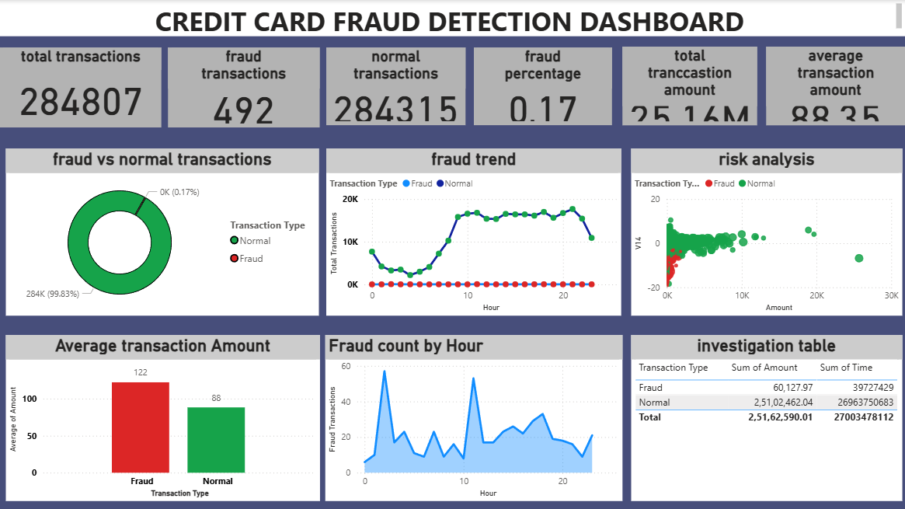

# 💳 Credit Card Fraud Detection Analysis using SQL & Power BI



---

## 📌 Project Overview

This project is an end-to-end **Credit Card Fraud Detection Analysis** developed using **MySQL** and **Power BI**. The objective is to analyse real-world credit card transactions, identify fraudulent activities, and present meaningful insights through an interactive dashboard.

The project demonstrates the complete analytics workflow—from database creation and SQL analysis to business intelligence dashboard development.

---

# 🎯 Objective

The main objectives of this project are to:

- Analyse customer transaction behaviour.
- Identify fraudulent transactions.
- Calculate fraud percentage and transaction statistics.
- Perform SQL-based business analysis.
- Build an interactive Power BI dashboard.
- Present insights that help support fraud monitoring and decision-making.

---

# 📂 Dataset

This project uses the publicly available **Credit Card Fraud Detection Dataset**.

**Source:**
https://www.kaggle.com/datasets/mlg-ulb/creditcardfraud

### Dataset Information

| Feature | Value |
|----------|------:|
| Total Transactions | 284,807 |
| Fraud Transactions | 492 |
| Normal Transactions | 284,315 |
| Fraud Percentage | 0.17% |
| Features | 31 |

Dataset Columns

- Time
- V1 – V28 (Anonymized Features)
- Amount
- Class
  - 0 = Normal Transaction
  - 1 = Fraud Transaction

---

# 🛠 Technologies Used

- MySQL
- SQL
- Power BI
- Microsoft Excel

---

# 🗄 Database Design

The project begins by creating a SQL table containing all transaction attributes.

The dataset is imported into MySQL using:

```sql
LOAD DATA LOCAL INFILE
```

The database contains:

- Transaction Time
- 28 anonymized variables
- Transaction Amount
- Transaction Class (Fraud / Normal)

---

# 🔍 SQL Analysis Performed

The following SQL analyses were performed:

- Total number of transactions
- Fraud vs Normal transaction count
- Fraud percentage
- Total transaction amount
- Average transaction amount
- Average amount by transaction class
- Top 10 highest transactions
- Top fraud transactions
- Transactions above average amount
- Maximum & minimum transaction amount
- Class-wise transaction summary
- Percentage contribution by transaction class

---

# 📊 Dashboard KPIs

The Power BI dashboard displays the following KPIs:

- ✅ Total Transactions
- ✅ Fraud Transactions
- ✅ Normal Transactions
- ✅ Fraud Percentage
- ✅ Total Transaction Amount
- ✅ Average Transaction Amount

---

# 📈 Dashboard Visualizations

The dashboard includes:

### 🟢 Fraud vs Normal Transactions

A donut chart showing the distribution of fraudulent and legitimate transactions.

---

### 📈 Fraud Trend

Displays transaction behaviour over time to identify fraud trends.

---

### ⚠ Risk Analysis

Scatter plot comparing transaction amount with transaction behaviour to detect suspicious activities.

---

### 📊 Average Transaction Amount

Compares average transaction values between Fraud and Normal transactions.

---

### ⏰ Fraud Count by Hour

Shows hourly fraud occurrences to identify peak fraud periods.

---

### 📋 Investigation Table

Summarises fraud and normal transaction values for quick investigation.

---

# 📷 Dashboard Preview


---

# 📄 SQL Script

The complete SQL analysis is available here:

```
SQL_CREDITCARD_ANALYSIS_PROJECT.sql
```

---

# 📑 Dashboard Report

A PDF version of the dashboard is included in this repository.

```
fraudanalysis.pdf
```

> **Note:**  
> The original Power BI (.pbix) file exceeds GitHub's 100 MB upload limit. Therefore, a PDF version of the dashboard has been included for easy viewing.

---

# 💡 Key Business Insights

- Only **0.17%** of all transactions are fraudulent.
- Fraudulent transactions are extremely rare compared to normal transactions.
- High-value transactions require additional monitoring.
- Transaction behaviour changes throughout the day, making time-based analysis valuable.
- Interactive dashboards enable quick identification of suspicious transaction patterns.

---

# 📁 Repository Structure

```
Credit-Card-Fraud-Detection-Analysis
│
├── README.md
├── SQL_CREDITCARD_ANALYSIS_PROJECT.sql
├── dashboard.png
├── fraudanalysis.pdf
└── LICENSE
```

---

# 🚀 Future Improvements

- Machine Learning-based fraud prediction
- Real-time fraud monitoring dashboard
- Customer risk scoring
- Fraud alert notification system
- Deployment using Power BI Service
- Integration with cloud databases

---

# 👨‍💻 Author

**Ramajayam T**

B.Tech – Artificial Intelligence & Data Science

Passionate about Data Analytics, SQL, Power BI, Machine Learning and solving real-world business problems.

---

# ⭐ If you found this project useful

Please consider giving this repository a ⭐ on GitHub.

It motivates me to build more data analytics projects.

---

## 📬 Connect With Me

**GitHub**

https://github.com/Ramajayam-T

**LinkedIn**

www.linkedin.com/in/ramajayam-t
